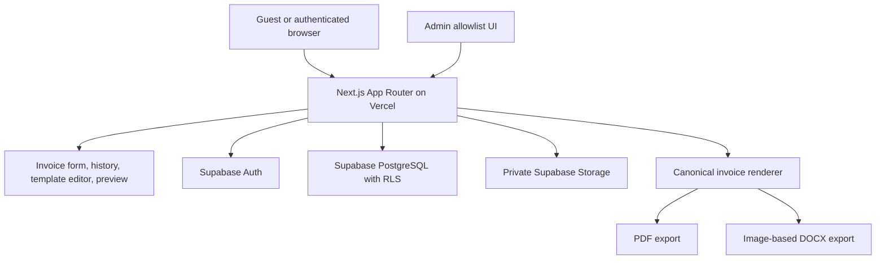

# Bangladesh Invoice Generator — Implementation Plan

**Date:** 2026-09-21  
**Status:** Validated for implementation  
**Scope:** Personal/demo project and invite-only private beta

## 1. Product goal

Build a responsive invoice generator for freelancers and small businesses in Bangladesh. Guests can generate and download an invoice without signing in. Invited users can create an account, autosave drafts, maintain invoice history, manage customers, customize one invoice template, and access their data across devices.

The first release is intentionally small: approximately 2–3 beta accounts, 2–3 invoices per account per month, zero monthly infrastructure cost, and no public commercial launch.

## 2. Confirmed requirements

### Access and accounts

- The root route opens directly to the invoice generator; no marketing landing page is required.
- Guests can generate and download PDF and exact-layout DOCX files.
- Guest data exists only in the current page session. Refreshing or closing the page loses it.
- Cloud accounts are invite-only through an admin-managed email allowlist.
- Allowlist matching trims whitespace and is case-insensitive; Gmail aliases are not rewritten.
- Authentication supports email/password and Google sign-in.
- Email verification and password reset are required.
- A verified email using both providers maps to one account.
- The first approved account becomes the initial admin.
- The admin can add/remove approved email addresses only. The admin cannot remove the current or last administrator.
- Removing an existing approved email immediately disables sign-in and permanently deletes that account’s data after explicit confirmation.
- Users can permanently delete their own account.
- Each account owns one isolated seller workspace/profile.
- No offline mode is required.

### Hosting and stack

- Next.js App Router.
- Strict TypeScript.
- Tailwind CSS and shadcn/ui.
- Vercel hosts the application and server-side export routes.
- Supabase in Singapore provides Auth, PostgreSQL, private Storage, and Row-Level Security.
- Supabase built-in email delivery is sufficient for the beta.
- Vercel Hobby is acceptable only for the personal/demo/private-beta phase. It must not be treated as a public commercial launch, and paid overages must remain disabled.

### Seller and customers

- One seller profile per account.
- Seller name is required before finalization/export.
- Seller company name is the primary heading, with seller name displayed directly beneath it. Both are required.
- Seller address is one free-form field.
- Seller email, phone, and website are optional.
- One private logo per seller: PNG, JPEG, or WebP, maximum 2 MB.
- A customer directory is available to signed-in users.
- Buyer name is required; buyer address, email, phone, and website are optional.
- Buyer company name is the primary heading, with buyer name displayed directly beneath it. Both are required.
- Buyer address is one free-form field.
- A new buyer entered on an invoice is automatically saved to the directory.
- Editing a selected customer while creating an invoice updates the customer record and the current invoice snapshot.
- Likely duplicate customers warn but remain allowed.
- Finalized invoices retain seller/customer snapshots; profile edits never silently mutate historical invoices.

### Invoice rules

- Bangladesh-focused, BDT only, displayed as `৳1,250`.
- No VAT, TIN, BIN, or tax calculations in version 1.
- Whole-number quantities and prices. Quantity must be at least 1; unit price may be 0.
- At least one line item is required. Each final line requires description, quantity, and unit price.
- No user-facing line-item cap, but safe technical payload and rendering limits are required.
- One invoice-level discount can be fixed BDT or a whole-number percentage from 0–100.
- Fixed discount cannot exceed subtotal.
- Calculation: sum line totals, calculate discount, round percentage discount half-up, subtract discount, never allow a negative total. Zero total is valid.
- Issue date defaults to today in `Asia/Dhaka`, uses `DD/MM/YYYY`, and is editable. Any valid past/future date is accepted.
- Due date is required, defaults to issue date, is editable, and may be before the issue date with a warning rather than a block.
- Notes and payment terms are optional free text.
- English UI; invoice content may be English or Bangla.

### Numbering and lifecycle

- Default numbering starts at `INV-0001`.
- Prefix contains only letters, numbers, and hyphens, maximum 10 characters.
- One global per-account sequence is used regardless of prefix.
- Prefix may change at any time; the sequence never resets.
- A number is assigned only when the user explicitly finalizes.
- Failed finalization consumes a number; gaps are never reused.
- Drafts are incomplete, autosaved, unnumbered, and shown in main history with a Draft label.
- Finalization is irreversible and required before export.
- Finalized invoices can be edited in place while retaining the same number; only the latest version is kept.
- `Revise as new` creates a new unnumbered draft.
- Payment statuses are manually selected from unpaid, paid, and overdue; overdue is not automatic.
- Delete moves an invoice to indefinite Trash. Trash supports restore and permanent delete.

### History and exports

- History supports viewing, PDF/DOCX re-download, editing, revise-as-new, search, filters, sorting, manual status changes, and deletion.
- Search is case-insensitive partial matching by invoice number and customer name.
- Filters: payment status, issue-date range, due-date range, minimum total, maximum total.
- Sort options: newest/oldest issue date, invoice number, amount, and due date. Default is newest issue date.
- Desktop history is a table; mobile history is stacked cards.
- PDF and DOCX have separate download buttons.
- Exports are available only after finalization.
- Exact visual parity has priority over DOCX editability. DOCX may contain rendered page images.
- PDF and DOCX use one canonical render source, A4 portrait, Bengali-capable fonts, multi-page output, and repeated line-item headers.
- Export errors leave invoice data unchanged and offer retry.
- No email delivery, share links, print workflow, or public invoice URLs.

### Template and responsive UX

- One structured custom template per account.
- Controls: optional-field visibility, section order, curated fonts/sizes, colors, margins, spacing, alignment, logo size/position, table borders/columns, header/footer content, A4 portrait settings.
- Required fields cannot be hidden.
- Curated Bengali-capable fonts are used; arbitrary font uploads are not supported.
- Desktop section reorder uses drag-and-drop; mobile uses up/down controls.
- Template autosaves and has Reset to default with confirmation.
- Desktop/tablet: form on left and sticky live preview on right.
- Mobile: form followed by preview; line items use stacked editable cards.
- Long invoices flow across pages and repeat table headers.
- Basic semantic/accessibility practices are required, but formal WCAG certification is out of scope.

## 3. Architecture



### Responsibility boundaries

- Client components manage form interaction, live preview, responsive controls, debounced autosave, and download states.
- Server routes validate every mutation, recalculate money, enforce authorization, allocate numbers, snapshot finalized documents, and generate exports.
- Supabase Auth owns identity and sessions.
- PostgreSQL owns durable domain data.
- Storage owns private logo assets and immutable logo versions.
- RLS provides tenant isolation; server-side authorization handles admin and destructive workflows.

### Proposed project structure


```text
app/
  page.tsx
  auth/{login,signup,reset-password,verify}/page.tsx
  auth/callback/route.ts
  invoices/page.tsx
  invoices/new/page.tsx
  invoices/[invoiceId]/page.tsx
  invoices/trash/page.tsx
  admin/allowlist/page.tsx
  account/settings/page.tsx
  api/invoices/{draft,finalize,update,trash,restore}/route.ts
  api/exports/{pdf,docx}/route.ts
  api/admin/allowlist/route.ts
  api/account/delete/route.ts
components/{invoice,history,template,preview,customer,seller,auth,ui}/
lib/{auth,db,validation,numbering,rendering,storage,security,dates,money}/
supabase/migrations/
tests/{unit,integration,e2e,visual}/
public/fonts/
```

## 4. Data model and security

Use UUID primary keys and `workspace_id` on every tenant-owned row. Store money as integer BDT, never floating-point values.

Core tables:

- `workspaces`: owner, status, timestamps, current template/logo references, sequence state.
- `profiles`: user ID, normalized email, admin flag, workspace, account status.
- `allowlist_entries`: original/normalized email, status, actor, timestamps, purge state.
- `seller_profiles`: name, free-form address, email, phone, website, current logo.
- `logo_assets`: immutable storage path, MIME type, byte size, hash, dimensions, deletion state.
- `customers`: workspace, name, address, email, phone, website, timestamps.
- `templates`: workspace, schema version, validated structured settings, timestamps.
- `invoices`: lifecycle status, number, sequence value, dates, payment status, totals, discount, canonical document, snapshots, version, timestamps.
- `invoice_lines`: invoice, position, description, quantity, unit price, line total.
- `number_reservations`: workspace, sequence value, prefix snapshot, number, invoice reference, consumed/orphaned state.
- `account_purge_jobs`: workspace, state, retry count, non-PII error code, timestamps.

At finalization, store immutable snapshots of seller, buyer, template, logo reference/version, renderer schema, and calculated values. Profile/template changes affect only future invoices. Editing a finalized invoice explicitly changes the latest content while retaining the number; no revision history is retained.

RLS must enforce:

- Users can only read/write their active workspace.
- Disabled/purging workspaces cannot access domain data.
- Clients cannot change ownership, workspace IDs, admin flags, invoice numbers, or sequence values.
- Admins manage allowlist entries but cannot inspect other users’ business data.
- Service-role credentials remain server-only.

Use immutable logo paths such as `workspaces/{workspaceId}/logos/{assetId}.{ext}`. Logos remain private and are accessed only by authorized server operations or short-lived signed URLs.

## 5. Validation and business rules

Use client validation for feedback and server validation as the authority.

- Seller and buyer names are required at finalization.
- At least one valid line is required.
- Quantity is an integer >= 1; unit price is an integer >= 0.
- Fixed discount is an integer from 0 through subtotal.
- Percentage discount is a whole integer from 0 through 100.
- Calculation uses integer arithmetic: subtotal, percentage discount, half-up rounding, then final total.
- Final total cannot be negative; zero is valid.
- Dates are date-only values. “Today” uses `Asia/Dhaka`; display is `DD/MM/YYYY`.
- Issue and due dates accept valid past/future dates. Due-before-issue warns but does not block.
- Prefix allows letters, numbers, and hyphens, maximum 10 characters.
- Number allocation occurs only at finalization and is never reused, including after failed finalization.
- Drafts are unnumbered; exports require finalized invoices.
- Notes/terms and descriptions are plain text with generous technical limits (for example, 2,000 characters per description and 10,000 for notes/terms).
- Validate optional emails and URLs when non-empty; keep phone text flexible.
- Validate uploaded file signatures as well as MIME type and size.
- Sanitize template values; reject arbitrary HTML/CSS, unknown fonts, unsafe colors, and hidden required fields.

## 6. Core user flows

### Guest generation

1. Open the root generator with in-memory state only.
2. Fill seller, buyer, dates, lines, discount, notes, and template options.
3. See the live preview.
4. Select PDF or DOCX.
5. Send the canonical payload to an unauthenticated export route.
6. Recalculate and validate on the server.
7. Return the file without creating a database row.
8. Preserve page state on a network error but do not persist after refresh/close.

### Account and invite flow

1. Admin adds a normalized email to the allowlist.
2. Approved user chooses email/password or Google.
3. Supabase verifies the identity and email.
4. Server checks allowlist and account status.
5. Create exactly one workspace/profile; first account becomes admin atomically.
6. Redirect to generator/history.

### Draft autosave

1. Create an unnumbered draft after the user starts editing.
2. Debounce meaningful changes.
3. Send the document with the client-known `version`.
4. Show `Saving`, `Saved`, `Not saved`, and retry states truthfully.
5. On stale version, show a conflict warning and preserve local unsaved data where feasible.
6. On a network failure, keep the editor usable and provide retry; do not claim success.

### Finalization

1. Confirm that finalization is irreversible and consumes a number.
2. Server validates the complete document and recalculates all totals.
3. Consume the next sequence value in a committed reservation.
4. Save the finalized invoice and immutable snapshots.
5. Make exports available.
6. Use an idempotency key so double clicks and lost responses do not create duplicate invoices.

### Edit/revise/delete

- Edit existing: change any invoice field, keep the number, retain the original layout/logo snapshot, and keep only the latest version.
- Revise as new: copy content into an unnumbered draft.
- Delete: move to indefinite Trash.
- Restore: preserve identity, number, status, and snapshots.
- Permanent delete: purge invoice data/assets but never release the number.
- Account deletion: purge all business data, storage, and Auth data without Trash.

## 7. Template, preview, and rendering

The template is a structured schema, not an arbitrary canvas. Supported sections include header, seller, buyer, metadata, line-item table, discounts, totals, notes, terms, and footer.

Required content cannot be hidden. Optional visibility includes seller/buyer contact fields, address, notes, and terms. Font family values come from a curated Bengali-capable list such as Noto Sans Bengali. Numeric controls, colors, widths, margins, and section IDs are bounded server-side.

Desktop/tablet use a two-column editor with the form on the left and sticky preview on the right. Mobile uses the form first and preview below. Desktop section ordering uses drag-and-drop; mobile uses up/down controls. Template changes autosave. Reset-to-default requires confirmation and never changes finalized snapshots.

The canonical invoice document must drive live preview, PDF, and DOCX. Pin font files, renderer versions, locale behavior, schema versions, and layout constants. The renderer must prove A4 portrait, Bengali/mixed content, long descriptions, multi-page output, repeated line headers, logo scaling, and stable Vercel-compatible execution.

PDF is the canonical exact-layout artifact. DOCX should embed the same rendered page images in an A4 portrait document to preserve exact visual parity. It is intentionally not promised to be semantically editable.

## 8. History, search, and responsive UI

History supports view, PDF/DOCX re-download, edit, revise-as-new, status change, search, filters, sort, and delete.

- Search: case-insensitive partial match by invoice number/customer name.
- Filters: payment status, issue-date range, due-date range, minimum total, maximum total.
- Sorts: newest/oldest issue date, invoice number, amount, due date.
- Default: newest issue date.
- Drafts appear in the main list with a Draft label.
- Trash has a separate view.
- Desktop uses a table; mobile uses stacked cards.
- Line items are table rows on desktop and stacked editable cards on mobile.
- Use semantic controls, visible validation errors, keyboard focus, readable contrast, and touch-safe controls even though formal WCAG certification is out of scope.

## 9. Error handling and privacy

Never show success before server confirmation. Preserve user input when possible, use stable internal error codes, provide concise user messages, and include a request ID for unexpected failures.

Important states include unapproved email, unverified account, provider failure, expired session, disabled workspace, autosave failure/conflict, invalid finalization data, number reservation failure, renderer timeout, invalid logo, storage cleanup failure, and export failure. Export failure never mutates invoice state or consumes another number.

Log only operational metadata such as request ID, route, status, duration, renderer version, format, page count, payload size, and non-reversible workspace identifier. Never log invoice content, names, addresses, contact data, notes, tokens, passwords, or full payloads.

## 10. Testing strategy

### Unit tests

Cover email normalization, date defaults, date formatting, money calculations, half-up rounding, zero totals, discount bounds, prefix validation, sequence allocation, failed-finalization gaps, search normalization, filter boundaries, template validation, sanitization, logo validation, and snapshot creation.

### Integration tests

Use a disposable Supabase environment to test Auth, allowlist enforcement, Google identity linking, first-admin race safety, RLS isolation, disabled sessions, account purge, private storage, draft version conflicts, customer auto-save, finalization idempotency, number races, Trash restore, and export authorization.

### End-to-end tests

Test guest creation/export/data loss on refresh, signup/verification/reset/Google login, seller/customer/template workflows, logo upload, drafts/autosave/conflicts, finalization/edit/revise, history search/filter/sort, Trash, account deletion, admin allowlist, responsive layouts, and retry states.

### Export visual regression

Fixtures must include English, Bangla, mixed scripts, long descriptions, long notes, multiple pages, discounts requiring half-up rounding, zero totals, logos, hidden optional fields, reordered sections, headers, and footers. Compare live preview, PDF page images, and DOCX-rendered page images with controlled rasterization tolerance.

### Security tests

Test cross-workspace IDs, RLS bypass, unauthorized admin routes, stale sessions after removal, XSS/template injection, invalid file signatures, storage path traversal, duplicate finalization, number races, account deletion targeting, and PII leakage.

## 11. Phased implementation

### Phase 0 — Scaffold and renderer spike

Create Next.js, strict TypeScript, Tailwind, shadcn/ui, linting, formatting, test tooling, money/date/validation primitives, and a renderer fixture proving Bengali and multi-page output.

**Verify:** build/typecheck pass; renderer output and Vercel runtime constraints are acceptable.

### Phase 1 — Supabase foundation

Create the Singapore project, Auth providers, migrations, schema, indexes, private storage, RLS, environment validation, and safe server/client clients.

**Verify:** clean migrations, cross-workspace RLS tests, private storage, no service key in browser.

### Phase 2 — Guest generator

Build the responsive form, live preview, in-memory guest state, server validation, PDF/DOCX routes, and retry/error states.

**Verify:** guests can download both formats and no guest row is created.

### Phase 3 — Auth and beta admin

Implement email/password, verification, reset, Google, identity linking, allowlist signup, first-admin bootstrap, allowlist UI, and destructive purge workflow.

**Verify:** approved/denied access, admin protection, account disable/purge, and identity-link tests pass.

### Phase 4 — Seller, customers, logo, templates

Implement seller profile, private logo assets, customer directory, duplicate warning, customer updates, structured template editor, autosave/reset, reorder controls, and snapshot behavior.

**Verify:** profile/customer/template changes are correct and historical snapshots stay stable.

### Phase 5 — Drafts and lifecycle

Implement cloud drafts, debounced autosave, save indicators, revision conflicts, numbering, finalization, editing, revise-as-new, status changes, history, search/filter/sort, Trash, restore, and permanent delete.

**Verify:** lifecycle and number-consumption tests pass.

### Phase 6 — Hardening and beta

Complete browser/responsive testing, visual regression, security tests, privacy/log review, free-tier monitoring, rollback/purge runbooks, and first-user rollout.

**Verify:** acceptance checklist passes before inviting all 2–3 beta accounts.

## 12. Release acceptance checklist

- [ ] Guest can download PDF and exact-layout DOCX without an account.
- [ ] Guest data is not persisted.
- [ ] Invite-only cloud signup works.
- [ ] Email/password and Google identities resolve to one account.
- [ ] RLS blocks cross-account access.
- [ ] Seller/buyer/line-item and discount validation works.
- [ ] BDT calculations and half-up rounding are tested.
- [ ] Draft autosave and conflict handling work.
- [ ] Finalization permanently consumes unique numbers.
- [ ] Editing keeps the number; revise-as-new creates a draft.
- [ ] Seller/customer/template/logo snapshots remain stable.
- [ ] History search/filter/sort, Trash, restore, and permanent delete work.
- [ ] PDF/DOCX use the canonical renderer and pass visual fixtures.
- [ ] English/Bangla and multi-page invoices render correctly.
- [ ] Desktop/tablet/mobile workflows work.
- [ ] Destructive admin/account deletion is confirmed and tested.
- [ ] Invoice PII does not appear in logs.
- [ ] Free-tier/private-beta restrictions are documented.

## 13. Beta launch sequence

1. Deploy to a protected Vercel preview.
2. Apply migrations to a private Singapore Supabase project.
3. Add the first approved email manually.
4. Create the initial admin account.
5. Test admin removal on a disposable account.
6. Test full account purge and storage cleanup.
7. Run export fixtures and RLS/security tests.
8. Verify guest exports do not create database rows.
9. Test drafts, finalization, editing, Trash, and restore.
10. Review logs for invoice PII.
11. Confirm free-tier limits and paid overages are disabled.
12. Invite the first tester, observe, then invite the remaining 2–3 accounts.
13. Keep public signup and public commercial launch disabled.

## 14. Future expansion gates

These are not part of the current implementation: guest rate limiting/CAPTCHA, public commercial launch, paid plans, custom SMTP, multiple workspaces, team members, revision history, sharing, email delivery, print features, taxes, more currencies, editable DOCX, offline mode, and a public API. Each requires a new product, legal, security, and cost review.
